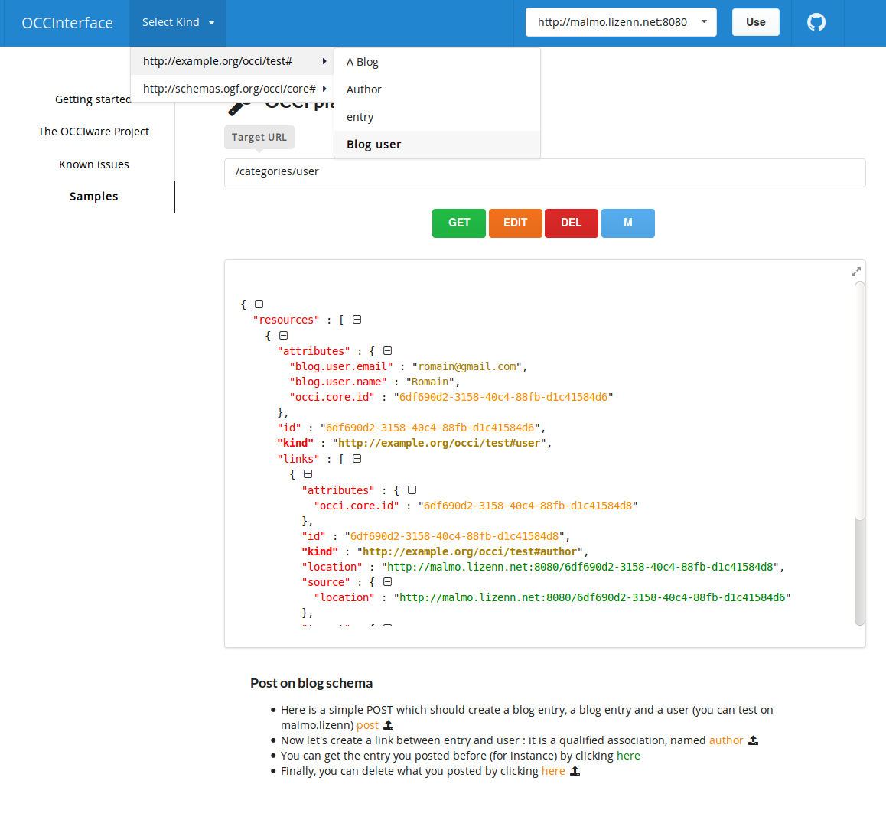

[](https://travis-ci.org/occiware/OCCInterface)
============
OCCInterface
============


OCCInterface is a generic application which let you explore and modify the resources of an OCCI server.
Its aims are multiple:
- give a productivity tool to developers calling the OCCI API
- manage and explore resources of an OCCI server easily
- vulgarize, explain OCCI to newcomers, diffuse the OCCI way of thinking
- be an (executable) reference documentation of capabilities of an OCCI implementation or of an integration of OCCI clouds, thanks to [executable REST samples](https://github.com/occiware/OCCInterface/blob/master/src/readings/GettingStarted.md).

A demo is avalaible here : http://occinterface.herokuapp.com/



## How to use it

### Through a docker image

If you have Docker installed (if not, you can find how to do so [here](https://docs.docker.com/engine/installation/)), and don't want to mess with your pre-existing dev environment, you may prefer this to the next section ("How to build and run it locally").

``` bash
git clone https://github.com/occiware/occiware-ozwillo.git
cd occiware-ozwillo/docker/occinterface
sudo docker build -t occinterface .
sudo docker run -p 3000:3000 occinterface
```

### Or build and run it locally

Requirement :
(some versions bellow should work too but have not been tested)
- nodeJS: >=6
- npm: >=3.8.9

NB. an easy way to install both, whatever the version of node you already have, is to install [nvm](https://github.com/creationix/nvm) :
``` bash
sudo apt-get update
sudo apt-get install build-essential libssl-dev
curl -o- https://raw.githubusercontent.com/creationix/nvm/v0.32.0/install.sh | bash
nvm install v6.2.0
```

Build and run :

``` bash
git clone https://github.com/occiware/OCCInterface.git
```

``` bash
npm install
```

``` bash
npm run dev
```

You can go to [http://localhost:3000/](http://localhost:3000/).

Then, you need to enter the URL of the OCCI server on the input at the top of the page (without "/" at the end)

## How to integrate it in your own OCCI implementation
TODO

## FAQ

- How to know the exact requests (and responses) sent by OCCInterface to the Cloud backend ?  
Simple : use an in-browser Javascript debug tool. If your browser is Firefox for instance, you can install Firebug, start it and then go in its Console (or Network) tab, where you can right-click on requests and see everything - and even "copy for curl".

- What is the syntax of executable REST samples ?  
Short answer : see examples in [src/readings](https://github.com/occiware/OCCInterface/blob/master/src/readings) such as [GettingStarted.md](https://github.com/occiware/OCCInterface/blob/master/src/readings/GettingStarted.md). Long answer : read below.

- What is a **playground link** and how to create it ?  
A playground link is a clickable link that make a GET request on the API and displays its content in the codeview.
To do so, create a classic link in markdown, and make your URL begin with "/"  
example:  
```
[/resources/compute](/resources/compute)
```

- What is a **sample link** and how to create it ?  
A sample link is a link that post datas onto the current server when clicking on it. The formating is as follow (in markdown):

``` JSON
text before %{
  "text": "sampleLink",
  "post": {
    "address": "/compute",
    "datas": {
      "kind":"http://schemas.ogf.org/occi/infrastructure#compute",
      "attributes": {
        "occi.compute.hostname" : "test",
        "occi.compute.state" : "inactive"
      },
      "id": "6df690d2-3158-40c4-88fb-d1c41584d6e5"
    }
  }
}% text after
```

It will result into a clickable link, which will post or put datas on click:

``` HTML
<p>text before <a>sampleLink</a> text after</p>
```

You can post an array instead of an object (in the "datas" attribute).
It can be put instead of posted, by using the "put" key instead of the "post" one.

If you want your sample link to post to different categories, just put an array instead of an object inside the "post" attribute. Example :

``` JSON
%{
  "text": "sampleLink",
  "post": [
    {
        "address": "/compute",
        "kind":"http://schemas.ogf.org/occi/infrastructure#compute",
        "datas": {
          "attributes": {
            "occi.compute.hostname" : "test",
            "occi.compute.state" : "inactive"
          },
          "id": "6df690d2-3158-40c4-88fb-d1c41584d6e5"
        }
    },
    {
        "address": "/storage",
        "datas": [
            {
              "kind":"http://schemas.ogf.org/occi/infrastructure#storage",
              "attributes": {
                "occi.storage.size" : 1000
              },
              "id": "6df690d2-3158-40c4-88fb-d1c41584d6e6"
            },
            {
              "kind":"http://schemas.ogf.org/occi/infrastructure#storage",
              "attributes": {
                "occi.storage.size" : 500
              },
              "id": "6df690d2-3158-40c4-88fb-d1c41584d689"
            }
        ]
    }
  ]
}%
```

- Can I delete datas with a sample link ?  
Yes, you can, with the following format :

``` JSON
%{
  "text": "my sample link",
  "del": "/6df690d2-3158-40c4-88fb-d1c41584d6e7"
}%
```

- can I execute an OCCI action with a sample link ?
Yes, you can, with the following format :

``` JSON
text before %{
  "text": "my sample action link",
  "post": {
    "address": "/compute/6df690d2-3158-40c4-88fb-d1c41584d6e5?action=stop",
    "datas": {
      "action":"http://schemas.ogf.org/occi/infrastructure/compute/action#stop",
      "attributes": {
        "method": "graceful"
      }
    }
  }
}% text after
```

- How to deploy on Heroku ?  

``` bash
#need to be done once
heroku git:remote -a herokiRepo
```
``` bash
npm run build
```
``` bash
git commit -am "deployment message"
```
``` bash
git push heroku master
```
- I have an issue "(mixed active content)", how to fix it ?
You need to have the same domain policy between your OCCI server and your OCCInterface server. For instance http with http, or https with https.


## OCCInterface with the MART server

Follow the instructions of the [MART server](https://github.com/cgourdin/MartServer/blob/master/doc/server.md) : check it out, then do

```
mvn initialize
mvn clean install
mvn exec:java
```

Beware, there are [several differences between MART and erocci](https://github.com/occiware/OCCInterface/issues/13), though OCCInterface does its best to work with both.

## OCCInterface with the erocci server

**How to configure your Erocci Server :**

Follow the instructions of [erocci](https://github.com/erocci/erocci/blob/master/doc/README.md)

Then, you need to edit the config/sys.config file.
Find the "backend" section, and modify it that way :

``` erlang
{backends,
    [
     {root, erocci_backend_mnesia,
      [{schema, "/path/to/config.xml"}],
      <<"/">>}
    ]
   }
```

Copy locally and use [this file](https://github.com/occiware/occi-schemas/blob/master/schemas/http%253A%252F%252Fschemas.ogf.org%252Focci%252Finfrastructure%2523.xml) as the config.xml file.

Then, you can start the server with

``` bash
./start.sh
```
